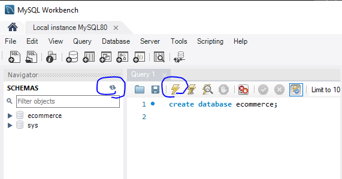

# JPA
* Reduce boilerplate code.
* Spring data jpa is repository abstraction on top of entity manager. and entity manager update the database.
* Hibernate is default JPA provider.


## Basic flow of spring data JPA

1. Service => 
2. JPA repository => JPA repository impl => 
3. JPA APIs => 4. Hibernate impl of JPA APIs => 
5. JDBC basic APIs => 
6. Database

## JPA vs Hibernate
- Spring data JPA = abstraction layer on top of JPA.

- JPA = ORM to manage relational data.

- Hibernate = impl of JPA

## Init App
### Dependency
1. Spring data JPA
2. MySQL Driver


## Create MySQL database

1. Type this query:
``` 
create database ecommerce;
```
2. Tap on exceute button.
3. Tap on refresh button.


## Connect Spring boot application to MySql db

- In _application.properties_ file add these lines to configure mysql and set username and passwqord of MySQL on it.
```
# Configure MySql
spring.datasource.url=jdbc:mysql://localhost:3306/ecommerce>useSSL=false
spring.datasource.username=root
spring.datasource.password==1234
```

```
MySQL5InnoDBDialect
spring.jpa.properties.hibernate.dialect=org.hibernate.dialect.MySQL5InnoDBDialect
```
- You can add this line to customize hibernate database schema generation.
    * __none__: hibernate is not going to create table for you. you have to create all tables manually
    * __create-only__: tells hibernate to generate the db schema from the entity model.
    * __create__: tells hibernate to drop the db schema and recreate it afterward using the entity model as a reference.
    * __drop__: tells hibernate to drop the db schema using the entity model as a reference for the DDL DROP statements.
    * __create-drop__: combine create and drop toghter.
    * __validate__: just validate the underlying db schema against the entity mapping .
    * __update__: update the existing schema based on entity mapping.

```
# none, create-only, drop, create-drop, validate, update
spring.jpa.hibernate.ddl-auto=none
```

- To show all the sql statements write the first line. and the second line format all these logs.
```
spring.jpa.show-sql=true
spring.jpa.properties.hibernate.format_sql=true
```

## Create first entity
1. First you should create new package named _domain_ or _entity_ or _model_ to put all JPA entities oin it.
2. Second create _repository_ package to 


In entity package create Product class.
Use __@Entity__ annotaion that imported from __jakarta.persistence__ to specify that this class is JPA entity.
And for each entity we need __primary key__, so use __@Id__ annotaion for id variable.
```
package com.negah.springdatajpa.entity;

import jakarta.persistence.Entity;
import jakarta.persistence.Id;

import java.math.BigDecimal;
import java.time.LocalDateTime;

@Entity
public class Product {
    @Id
    private Long id;
    private String sku;
    private String name;
    private String description;
    private BigDecimal price;
    private boolean active;
    private String imageUrl;
    private LocalDateTime dateCreated;
    private LocalDateTime lastUpdated;

    //getter and setters.
}
```
Now if you run project and _ddl-auto_ parameter of _application.properties_ has been set to _update_, Product table will create automatically in MySQL.

*Not that for varable with two or more words like _dateCreated_, Hibernate create that field in underscore format, like _date_created_.